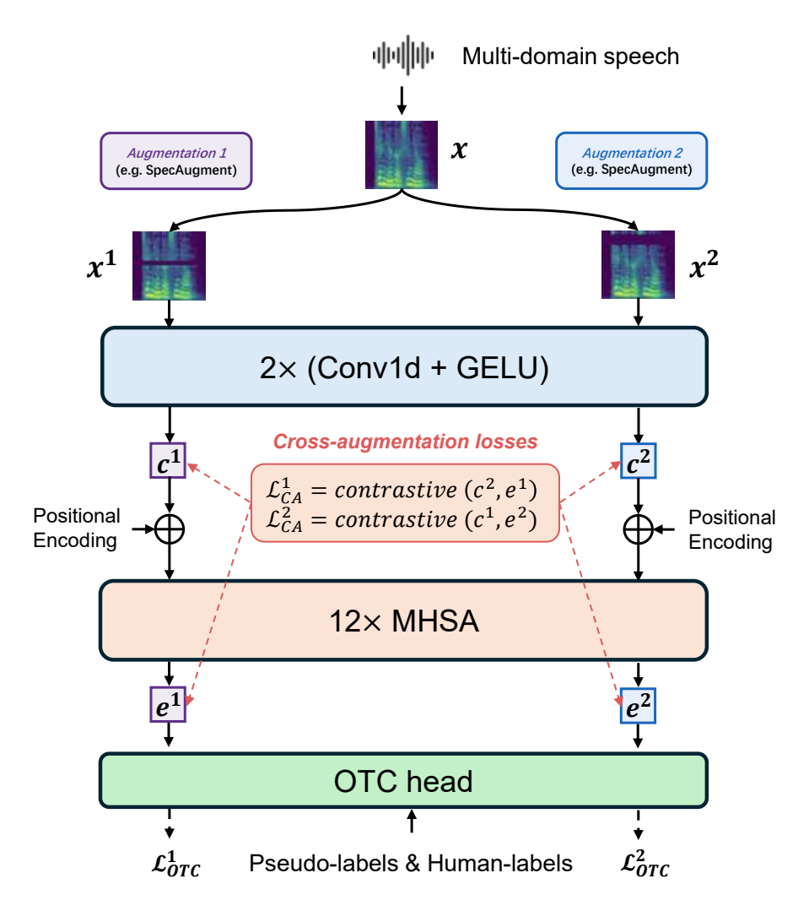
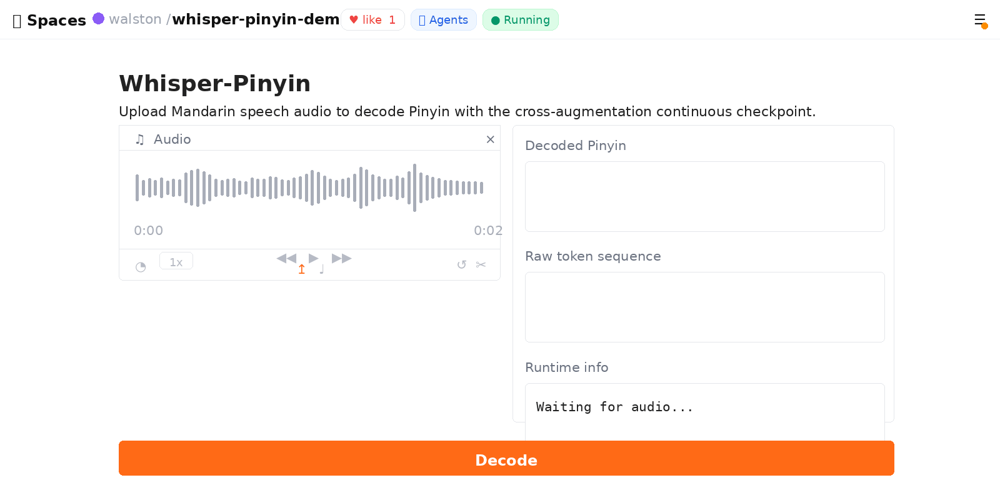

# 🎧 Whisper-Pinyin

[](https://www.python.org/)
[](https://pytorch.org/)
[](https://github.com/k2-fsa/k2)
[](LICENSE)

Official implementation of **Whisper-Pinyin**, a Pinyin-level speech model for Mandarin speech assessment.

## Results

<table>
<tr>
<td width="50%" valign="top">

<h3>AISHELL-3 Test Set</h3>

<p>Whisper-Pinyin with cross-augmentation consistency regularization achieves an <b>18.6%</b> relative reduction in token error rate over the Whisper-OTC baseline on the AISHELL-3 test set.</p>

<table>
<tr>
<th>Model</th>
<th align="right">Token error rate</th>
</tr>
<tr>
<td>Whisper-OTC (baseline)</td>
<td align="right">4.09%</td>
</tr>
<tr>
<td><strong>Whisper-Pinyin</strong></td>
<td align="right"><strong>3.33%</strong></td>
</tr>
</table>
 

</td>
<td width="50%" valign="top">



 
</td>
</tr>
</table>

Detailed results can be found in
`results/results_cross_continuous_aishell3_test.txt`
and 
`results/results_otc_aishell3_test.txt`

## Demo

[](https://huggingface.co/spaces/walston/whisper-pinyin-demo)
[](https://huggingface.co/walston/whisper-pinyin)

Try Whisper-Pinyin directly in the browser with the hosted Hugging Face Space:
[**walston/whisper-pinyin-demo**](https://huggingface.co/spaces/walston/whisper-pinyin-demo).

<p align="center">
  <a href="https://huggingface.co/spaces/walston/whisper-pinyin-demo">
    
  </a>
</p>

The demo runs the cross-augmentation continuous checkpoint from the
[walston/whisper-pinyin](https://huggingface.co/walston/whisper-pinyin)
model repository. On the public CPU Space, decoding runs at approximately **RTF 1.76**.

## 🚀 Quick Start

```bash
git clone https://github.com/oshindow/whisper_pinyin.git
cd whisper_pinyin

conda create -n whisper-pinyin python=3.8 ffmpeg -y
conda activate whisper-pinyin
pip install -r requirements.txt
pip install pytorch-lightning==2.4.0 --no-deps

python -c "import torch, torchaudio, k2; print(torch.__version__)"
```


## 📦 Data Preparation

This repository already provides AISHELL-3 text manifests under:

```text
dump/aishell3/train/text
dump/aishell3/val/text
dump/aishell3/val/text_100
dump/aishell3/test/text
```

You only need to prepare the AISHELL-3 audio files. Convert all audio to 16 kHz, 16-bit, mono-channel WAV files and place them with the expected directory layout:

```text
<data-root>/aishell3/
  train/wav_16k/<speaker_id>/<utt_id>.wav
  test/wav_16k/<speaker_id>/<utt_id>.wav
```

`dump/aishell3/val/text_100` is a 100-utterance validation subset randomly sampled from `dump/aishell3/val/text`.

## 🏋️ Fine-Tuning

Before training, update `DATA_ROOT` and `EXP_DIR` in `run.sh` to match your local paths.

### Run the Default Experiment

The provided `run.sh` launches the Whisper-Pinyin with Cross-augmentation (continuous) experiment:

```bash
./run.sh
```

Recommended setting for a single NVIDIA RTX A5000 with 24 GB VRAM:

- Batch size: 16
- Runtime: approximately 60 minutes per epoch

### Baseline: Whisper-OTC

Recommended setting for a single NVIDIA RTX A5000 with 24 GB VRAM:

- Batch size: 32
- Runtime: approximately 30 minutes per epoch

```bash
CUDA_VISIBLE_DEVICES=0 python scripts/baseline/finetuning_pinyin_otc.py \
  --epoch 10 \
  --data-root $DATA_ROOT \
  --train-name whisper_pinyin_aishell3_otc \
  --train-id 001 \
  --exp-dir $EXP_DIR \
  --train-path dump/aishell3/train/text \
  --model-name small \
  --ctc-layers 2 \
  --n_mels 80 \
  --batch-size 16 \
  --precision bf16-mixed \
  --learning-rate 1e-4 \
  --weight-decay 0.01 \
  --adam-epsilon 1e-8 \
  --warmup-steps 1000 > exp_whisper_otc.log
```
 
 

## 🔍 Inference

Run Whisper-Pinyin inference on the AISHELL-3 test manifest:

```bash
CUDA_VISIBLE_DEVICES=0 python inference/inference_pinyin_ctc.py \
  --checkpoint path/to/your/checkpoint \
  --test-path dump/aishell3/test/text \
  --output results_aishell3_test.txt
```

Run Wav2Vec2 baseline inference:

```bash
CUDA_VISIBLE_DEVICES=0 python inference/inference_pinyin_ctc_w2v.py \
  --checkpoint path/to/your/checkpoint \
  --test-path dump/aishell3/test/text \
  --output results_w2v_aishell3_test.txt
```
  

## 📝 Notes for Users

- This project borrows and adapts a lot of code and ideas from [Whisper](https://github.com/openai/whisper), [k2](https://github.com/k2-fsa/k2), [icefall](https://github.com/k2-fsa/icefall), [SpeechBrain](https://github.com/speechbrain/speechbrain), and [FSQ](https://arxiv.org/abs/2309.15505). Please also follow the licenses and citation guidance of those upstream projects when using this repository.
- See [LICENSE](LICENSE) for the project license, [THIRD_PARTY_NOTICES.md](THIRD_PARTY_NOTICES.md) for upstream code notices, and `LICENSES/` for third-party license references.
